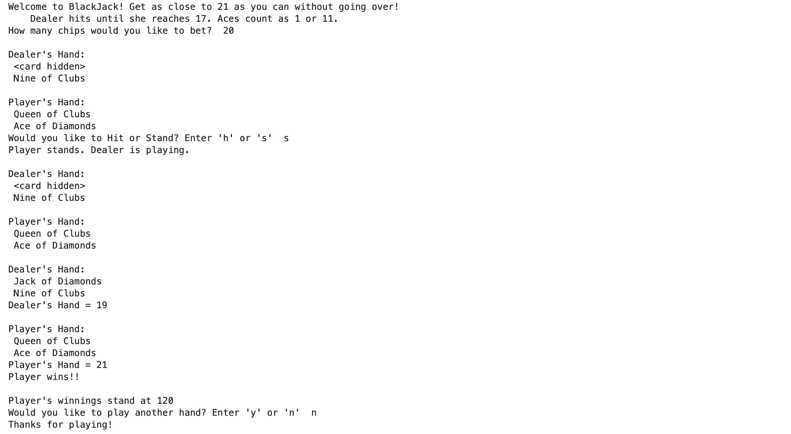

# Black_Jack

### [Project_3:Black_Jack](https://github.com/PRANAVKUMAR183/Credit_card-validator) (Link to project)

*The game prompts players to get as close to 21 as possible without exceeding it. In this round, the player stood at 21 with a Queen and Ace, while the dealer reached 19. The player won the hand, increasing their winnings to 120 chips.

**Outcome**:

